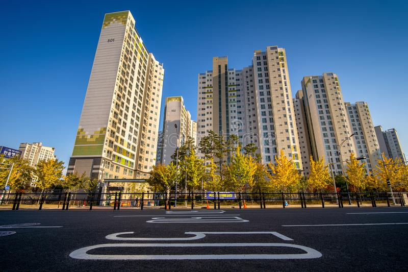

# Daegu Apartment Price Prediction

****

# **Business Problem Understanding**
## **Context**
Daegu yang memiliki nama resmi Kota Metropolitan Daegu ini adalah metropolitan terbesar ke-3 di Korea Selatan setelah Seoul dan Busan yang memiliki Penduduk sekitar 2,5 Juta jiwa. Daegu dikelilingi oleh pegunungan Palgong-san di utara, Biseul-san di selatan, kaki bukit Gaya-san di barat, dan satu deretan bukit kecil di timur. Dengan pemandangan indah dan suasana yang tampak cukup sejuk ini, Daegu tetap saja seperti kota-kota metropolitan lainnya. Dengan kehidupan perkotaan yang padat penduduk namun lahan terbatas membuat Daegu seperti kota metropolitan lainnya yang mengandalkan apartment sebagai pilihan untuk tempat tinggal penduduknya. Di Korea Selatan sendiri terutama di kota-kota besar kebanyakan orang lebih memilih menjual/membeli apartment melalui agen properti. Ini membuat banyaknya agen properti yang menjajakan jasanya dalam membantu menjual atau membeli apartment. Karena jika menggunakan jasa agen properti, pembeli maupun penjual tidak perlu kesusahan dalam transaksi maupun surat-surat yang harus diurus.

[Sumber](https://en.wikipedia.org/wiki/Daegu) 
***
## **Problem Statement**
Masalah pada bisnis ini cukup sulit karena harus menentukan harga jual yang cocok untuk suatu apartment dengan fasilitas dan fitur-fitur tertentu di daerah Daebong, Kota Daegu ini. Oleh karena itu dibutuhkan Model yang tepat untuk menyelesaikan masalah penentuan harga jual apartment, agar dapat menghasilkan keuntungan bagi pemilik properti serta agen properti. Selain itu agar harga apartment di daerah itu terkesan adil dan tidak mengalami perbedaan yg besar antara satu apartment dengan apartment lainnya
***
## **Goals**
Berdasarkan permasalahan ini, Agen properti tentu perlu memiliki alat yang dapat memprediksi serta membantu klien mereka (dalam hal ini tuan rumah) untuk dapat **menentukan harga jual properti yang tepat**. Adanya perbedaan pada berbagai fitur yang terdapat pada suatu properti, seperti tahun dibangunnya, lokasi, tipe hallway dapat menambah keakuratan prediksi harga jual, yang mana dapat mendatangkan profit bagi tuan rumah.
***
## **Analytic Approach**
Jadi, yang perlu kita lakukan adalah menganalisis data untuk dapat menemukan pola dari fitur-fitur yang ada, yang membedakan satu apartment dengan yang lainnya.
Selanjutnya, kita akan membangun suatu model regresi yang akan membantu agen properti untuk dapat menyediakan 'tool' prediksi harga jual apartment yang baru masuk dalam daftar Agen Penjualan Properti, yang mana akan berguna untuk tuan rumah dalam menentukan harga jual apartmentnya.
***
## **Metric Evaluation**
Diantara Evaluasi metrik yang sering digunakan untuk memprediksi seperti MSE, RMSE dan MAPE, kali ini saya memilih mengggunaka **MAE**. Dimana MAE adalah rataan nilai absolut dari error. Cara kerja nya adalah Semakin kecil nilai MAE yang dihasilkan, berarti model semakin akurat dalam memprediksi harga sewa sesuai dengan limitasi fitur yang digunakan. 

**Attributes Information**

| **Attribute** | **Data Type** | **Description** |
| --- | --- | --- |
| HallwayType | Object | Tipe lorong masuk apartment  |
| TimeToSubway | Object | Waktu yang dibutuhkan menuju Stasiun Subway (min) |
| SubwayStation | Object | Nama Stasiun Subway terdekat |
| N_FacilitiesNearBy(ETC) | Float | Jumlah fasilitas di dekat apartment seperti hotel, sekolah berkebutuhan khusus |
| N_FacilitiesNearBy(PublicOffice) | Float | Jumlah Kantor Layanan Publik di dekat apartment |
| N_SchoolNearBy(University) | Float | Jumlah Universitas di dekat apartment |
| N_Parkinglot(Basement) | Float | Jumlah lahan parkir di basement |
| YearBuilt | Integer | Tahun dibangun |
| N_FacilitiesInApt | Integer | Jumlah fasilitas untuk penghuni seperti kolam renang, gym, taman bermain |
| Size(sqf) | Integer | Luas apartment |
| SalePrice | Integer | Harga apartment (US dollar) |
